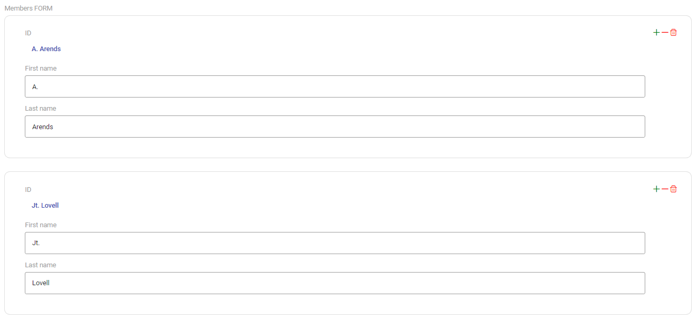

# Box Components

Within Ampersand, Box-Components are a type of interface components that represent a structure. This structure is meant to contain other interface components.

For example, you might want to have a project page with a project name and members that are on that specific project. This could look like:

```
Project page
│   Project name
|   Description
|   Start date
└───Project members
    |   Member1
    |   └───Name
    |   └───Email
    |   Member2
    |   └───Name
    |   └───Email
    |   Member3
    |   └───Name
    |   └───Email
```

This corresponds to the following structure:

```
Box-Form
│   Atomic-Alphanumeric
│   Atomic-Bigalphanumeric
│   Atomic-Date
└───Box-Table
    │   Atomic-Alphanumeric
    |   Atomic-Alphanumeric
```

## BaseBoxComponent

The `BaseBoxComponent` is inherited by all of the Box-Components. Box-Components share a lot of logic, so the BaseBoxComponent is inherited by all Box-Components. Here is a list of functionality that all Box-Components require:

- CRUD rights
- `createItem()`
- `removeItem()`
- `deleteItem()`
- `@Input resource`
- `@Input propertyName`

### CRUD rights

Each Box-Component has CRUD rights. These rights give the user the ability to Create, Read, Update, and/or Delete items.

### Create Item

The `createItem()` function allows a new instance to be **created** for the Box-Component. Take for instance the Box-Table for the table of members that are working in a project. This allows creating a new person that works on the same project.

### Remove item

The `removeItem()` function allows items to be **removed** from the Box-Component. Take for instance the Box-Table for the table of members that are working in a project. This allows members to be removed from the project.

### Delete item

The `deleteitem()` function allows items to be **deleted** from the Box-Component. This is very similar to the `removeItem()` function. This differs in that `removeItem()` merely removes the item, whereas `deleteItem()` deletes the whole item from the database. Take for instance the Box-Table for the table of members that are working in a project. This allows members to be deleted from the database. When a member works on multiple projects, but is deleted, they will thus also be removed from all projects.

## Box-Form

The **Box-Form** creates a layout as a form.

This is an example of the form. This takes is on a project page, where the project members are viewed in the format of a form. 

The generated Box-Form consists of an `<app-box-form></app-box-form>` selector with an `<ng-template></ng-template>`. The `ng-template` contains other components that are viewed inside the Box-Form. To see how this works, you can watch [this video](https://www.youtube.com/watch?v=dau7kQMdH4A).

```html
<!-- Box-FORM.html -->
<div>
  <app-box-form
    crud="CRUD"
    [interfaceComponent]="this"
    [resource]="resource"
    propertyName="Members_32_FORM"
    [data]="resource.Members_32_FORM"
  >
    <ng-template [boxFormTemplate]="resource.Members_32_FORM" let-resource>
      <div class="formgrid grid">
        <div class="field col-12 box-form-field">
          <label class="box-form-label">ID</label>
          <div class="box-form-value">
            <app-atomic-object></app-atomic-object>
          </div>
        </div>
        <!-- some other components... -->
      </div>
    </ng-template>
  </app-box-form>
</div>
```

## Box-Table

The **Box-Table** creates a layout as a table.

This is an example of the table. This takes is on a project page, where the project members are viewed in the format of a table. 

The generated Box-Table consists of an `<app-box-table></app-box-table>` selector with two `<ng-template></ng-template>`. The first `ng-template` contains the names of the table headers, whereas the second `ng-template` contains the components that are viewed inside the Box-Table. To see how this works, you can watch [this video](https://www.youtube.com/watch?v=dau7kQMdH4A).

```html
<!-- Box-TABLE.html -->
<div>
  <app-box-table
    crud="CRUD"
    [interfaceComponent]="this"
    [resource]="resource"
    propertyName="Members_32_TABLE"
    [data]="resource.Members_32_TABLE"
    sortable
    sortBy="Name"
    order="desc"
  >
    <ng-template boxTableHeader>
      <th>ID</th>
      <!-- some other components wrapped in <th></th>-->
    </ng-template>
    <ng-template [boxTableRow]="resource.Members_32_TABLE" let-resource>
      <td>
        <app-atomic-object></app-atomic-object>
      </td>
      <!-- some other components wrapped in <td></td>... -->
    </ng-template>
  </app-box-table>
</div>
```

## Box-Tabs

## Box-Raw
